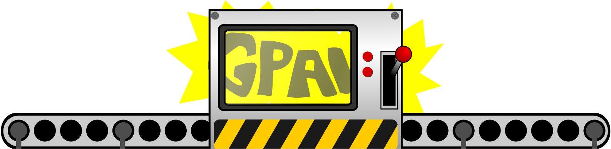

# ACTgpaw

<!--- [//]: # (Badges) 
[](https://github.com/REPLACE_WITH_OWNER_ACCOUNT/actgpaw/actions?query=workflow%3ACI)
[](https://codecov.io/gh/REPLACE_WITH_OWNER_ACCOUNT/ACTgpaw/branch/master) -->


A Python package for autonomous convergence test of GPAW. 



---

### Table of Contents

- [Description](#description)
- [Installation](#installation)
- [How To Use](#how-to-use)
- [References](#references)
- [License](#license)
- [Author Info](#author-info)

---

## Description

Autonomous Convergence Toolkit for GPAW (**ACTgpaw**) is a python package aiming to streamline the convergence test procedures before the DFT study in [GPAW](https://wiki.fysik.dtu.dk/gpaw/#).

#### Current available autonomous convergence tests:
* Conventional Cell Calculator Settings
    * Grid Points 
    * K Points 
    * Smearing 
* Slab Super Cell Settings
    * Slab Layer

#### A useful add-on for adsorption energy: 
* This package can compute and select the lowest adsorption energy site from all sites created using [autocat](https://github.com/aced-differentiate/auto_cat). 

[Back To The Top](#actgpaw)

---

## How To Use

### Requirements

### Installation
You can get the source for the latest release from (https://github.com/kianpu34593/actgpaw/):
```bash
$ git clone -b stable https://github.com/kianpu34593/actgpaw.git
```
Then, simply navigate to actgpaw directory and install using pip:
```bash
$ pip install -e .
```

### Tutorials
#### Workflow Introduction
**ACTgpaw** is very easy and intuitive to use. In general, the workflow looks like this:
* Start by preparing a .cif file of the material of interests;
* Create a directory for this material which is used to store optimization files.
* Write a script to use bulk_autoconv module to optimize the calculator parameters of conventional cell.
* Analyze and create the surface of interests of the optimized material.
* Write a script to use surf_autoconv module to optimize the number of layers of the slab model.
* Generate adsorption sites on the surface using [autocat](https://github.com/aced-differentiate/auto_cat).
* Write a script to use ads_select module to pick the lowest adsorption energy site.
<div align="center">Workflow Visualization


</div>

#### STEP 0: Cif File Preparation
* Before downloading your favorite material's cif file, you want to create a directory to store it. Since you already spent time creating one directory, why not create a directory to store the final database as well? Luckily, a big directory creation function is implemented. 

    * You can create the input and ouput directories as following:
        ```python
        from actgpaw import utils as ut
        ut.create_big_dir()
        ```
    * You should get the following sub-directories:
        ```bash
        actgpaw_demo/
        ├── final_database
        ├── orig_cif_data
        └── setup.ipynb
        ```
* Now you can download cif file in orig_cif_data. You can manually select and download cif file from [The Materials Project](https://materialsproject.org/). Alternatively, you can also use the cif_grabber function in **ACTgpaw** by providing the API key and formula of your favorite material. cif_grabber function will download the cif file of the lowest formation energy.
    * We will use Cu as an example:
        ```python
        from actgpaw import utils as ut
        API_key = "your-api-key"
        pretty_formula = 'Cu'
        ut.cif_grabber(API_key,pretty_formula)
        ```
    * You should get the following sub-directories:
        ```bash
        actgpaw_demo/
        ├── final_database
        ├── orig_cif_data
        │   └── Cu_mp-30.cif
        └── setup.ipynb
        ```
[Back To Workflow Intro](#workflow-introduction)
#### STEP 1: Create Directory for the Material
* We will first converge the calculator parameters of the bulk energy calculation. Therefore, we will only create bulk directory of the material of interest. When the surface analysis is finished, we can then create surf directory of the material of interest.
    * We will continue to use Cu as our example:
         ```python
        from glob import glob
        import re
        element_ls = glob('orig_cif_data/**.cif')
        for element in element_ls:
            element = re.split('\.',element)[0].split('/')[1]
            ut.create_element_dir(element, options = ['bulk'], optimized_parameters = ['h','k','sw'])
        ```
    * You should get the following sub-directories:
        ```bash
        actgpaw_demo/
        ├── Cu_mp-30
        │   └── bulk
        │       ├── results_h
        │       │   └── eos_fit
        │       ├── results_k
        │       │   └── eos_fit
        │       └── results_sw
        │           └── eos_fit
        ├── final_database
        ├── orig_cif_data
        │   └── Cu_mp-30.cif
        └── setup.ipynb
        ```
[Back To Workflow Intro](#workflow-introduction)
#### STEP 2: Bulk Convergence 
* Create a script in the actgpaw_demo directory. This script should include three parts:
    * Input the material
    * Initalize the calculator
    * Call bulk_auto_conv module
        * As an example, your code should look like the following,
        ```python
        from gpaw import GPAW,Mixer,Davidson
        from ase.calculators.calculator import kptdensity2monkhorstpack as kdens2mp
        from actgpaw import bulk_autoconv as bulk_ac

        # input the material
        element = 'Cu_mp-30' #the name should be the same as the cif file
        element_atom = bulk_ac.bulk_builder(element) #cif --> ase atom
        
        # initalize the calulator
        ## convert k density to kpts based on cell size
        kpts = kdens2mp(element_atom) 
        calc=GPAW(xc = 'PBE',
                    h = 0.16,
                    kpts = kpts,
                    spinpol = False,
                    maxiter = 333,
                    mixer = Mixer(0.05,5,50),
                    eigensolver = Davidson(3),
                    occupations = {'name':'fermi-dirac','width':0.1})
        
        # call bulk_auto_conv module
        bulk_ac.bulk_auto_conv(element, #input material
                                calc, #initial calculator
                                rela_tol=10*10**(-3), #convergence criteria
                                temp_print=True, #print out the convergence process
                                ) 
        ```
        * After running the script, you should get the following outputs:
            * Optimized bulk material with converged calculator settings saved in a database called "bulk.db" in final_database/ directory.
            * A result report with convergence process generated in the material/bulk/ directory.
            * Intermediate files during the convergence process all saved in pre-generated directory.
            ```bash
            Cu_mp-30/
            └── bulk
                ├── sw_converge.db
                ├── results_report.txt
                ├── grid_converge.db
                ├── kpts_converge.db
                ├── results_h
                │   ├── Cu4_1.0047634991283902-0.16.gpw
                │   ├── Cu4_1.0047634991283902-0.16.log
                │   ├── Cu4_1.0047634991283902-0.16.traj
                │   ├── Cu4_1.0047634991283902-0.16.txt
                │   ├── Cu4_1.0059105517163032-0.12.gpw
                │   ├── Cu4_1.0059105517163032-0.12.log
                │   ├── Cu4_1.0059105517163032-0.12.traj
                │   ├── Cu4_1.0059105517163032-0.12.txt
                │   ├── Cu4_1.00599176966003-0.14.gpw
                │   ├── Cu4_1.00599176966003-0.14.log
                │   ├── Cu4_1.00599176966003-0.14.traj
                │   ├── Cu4_1.00599176966003-0.14.txt
                │   ├── Cu4_1.006041218079274-0.08.gpw
                │   ├── Cu4_1.006041218079274-0.08.log
                │   ├── Cu4_1.006041218079274-0.08.traj
                │   ├── Cu4_1.006041218079274-0.08.txt
                │   ├── Cu4_1.0060808367744312-0.1.gpw
                │   ├── Cu4_1.0060808367744312-0.1.log
                │   ├── Cu4_1.0060808367744312-0.1.traj
                │   ├── Cu4_1.0060808367744312-0.1.txt
                │   └── eos_fit
                │       └── eos-fit-files
                ├── results_k
                │   ├── Cu4_1.0058396320105072-8.gpw
                │   ├── Cu4_1.0058396320105072-8.log
                │   ├── Cu4_1.0058396320105072-8.traj
                │   ├── Cu4_1.0058396320105072-8.txt
                │   ├── Cu4_1.0062026486279967-12.gpw
                │   ├── Cu4_1.0062026486279967-12.log
                │   ├── Cu4_1.0062026486279967-12.traj
                │   ├── Cu4_1.0062026486279967-12.txt
                │   ├── Cu4_1.0063333842390076-10.gpw
                │   ├── Cu4_1.0063333842390076-10.log
                │   ├── Cu4_1.0063333842390076-10.traj
                │   ├── Cu4_1.0063333842390076-10.txt
                │   └── eos_fit
                │       └── eos-fit-files
                ├── results_sw
                │   ├── Cu4_1.0057154328476883-0.025.gpw
                │   ├── Cu4_1.0057154328476883-0.025.log
                │   ├── Cu4_1.0057154328476883-0.025.traj
                │   ├── Cu4_1.0057154328476883-0.025.txt
                │   ├── Cu4_1.0057481462190085-0.05.gpw
                │   ├── Cu4_1.0057481462190085-0.05.log
                │   ├── Cu4_1.0057481462190085-0.05.traj
                │   ├── Cu4_1.0057481462190085-0.05.txt
                └── └── eos_fit
                        └── eos-fit-files
            ```
[Back To Workflow Intro](#workflow-introduction)

#### STEP 3: Surface Analysis
* STEP 3 is optional. Sometimes, however, choosing the right surface facet and termination can be quite challenging. That is exactly what STEP 3 is setup for. You can use STEP 3 to analyze the slabs and save them for further investigation.
    * Under the hood, the code implemented for surface analysis is using [ASE](https://wiki.fysik.dtu.dk/ase/ase/build/surface.html) surface module and [Pymatgen](https://pymatgen.org/pymatgen.core.surface.html) surface module. With **ACTgpaw**, you can easily combine these two powerful surface creation function together.
    * What you need for this step:
        * An optimized bulk material stored in "bulk.db" database which should be located in the final_database/ directory. 
        * (Optional) A visualization software for slab
        * (Optional) A cup of coffee/tea 
    * We will use Cu as an example:
        * First, we can look at all the possible miller indices. This might be simple for metals with low-index surface. But it is very useful when dealing with alloys.
        ```python
        from actgpaw import surface as surf
        # specify the material
        element = 'Cu_mp-30'

        # maximum miller index
        max_ind = 1

        # layer parameters
        layers = 4
        vacuum_layers = 8

        # find all facets which have symmetric top and bottom termination 
        surf.sym_all_slab(element, max_ind, layers, vacuum_layers)
        ```
        * For Cu, the output is the following. The number of different shift is showing different kinds of terminations this facet have.
        ```bash
        Miller Index	Num of Different Shift(s)
        (1, 1, 1)	    1
        (1, 1, 0)	    1
        (1, 0, 0)	    1
        ```
        * Next, we can pick one of the miller indices shown above to analyze in details. You can generate a surface plot and save the slab as cif file for further investigation. This is very useful for alloys.
        ```python
        from actgpaw import surface as surf
        # specify the material
        element = 'Cu_mp-30'

        # specify the miller index
        ind = (1,1,1)

        # specify the layer parameters
        layers = 4
        vacuum_layers = 2

        # surface generator under the hood
        option = 'pymatgen'

        # generate plot
        plot = True

        # save as cif file 
        save = False

        # which one to save 
        order = 0
        
        surf.surf_creator(element, ind, layers, vacuum_layers, 
                            unit=True, # if using pymatgen, specify the unit of layers (number[True]/length[False])
                            option=option,
                            save=save,
                            order=order,
                            plot=plot)
        ```
        * For Cu, the output is the following. You may have several possible terminations shown and plotted for alloys.
        ```bash
        No.	    Layers	    Angles[deg]				Cell Length[ang]
        0	    4           [ 90.  90. 120.]	    [ 2.5756  2.5756 12.6177]
        ```
        

[Back To Workflow Intro](#workflow-introduction)


```html
    <p>dummy code</p>
```
[Back To The Top](#actgpaw)

---

## References
[Back To The Top](#read-me-template)

---

## License

MIT License

Copyright (c) [2017] [James Q Quick]

Permission is hereby granted, free of charge, to any person obtaining a copy
of this software and associated documentation files (the "Software"), to deal
in the Software without restriction, including without limitation the rights
to use, copy, modify, merge, publish, distribute, sublicense, and/or sell
copies of the Software, and to permit persons to whom the Software is
furnished to do so, subject to the following conditions:

The above copyright notice and this permission notice shall be included in all
copies or substantial portions of the Software.

THE SOFTWARE IS PROVIDED "AS IS", WITHOUT WARRANTY OF ANY KIND, EXPRESS OR
IMPLIED, INCLUDING BUT NOT LIMITED TO THE WARRANTIES OF MERCHANTABILITY,
FITNESS FOR A PARTICULAR PURPOSE AND NONINFRINGEMENT. IN NO EVENT SHALL THE
AUTHORS OR COPYRIGHT HOLDERS BE LIABLE FOR ANY CLAIM, DAMAGES OR OTHER
LIABILITY, WHETHER IN AN ACTION OF CONTRACT, TORT OR OTHERWISE, ARISING FROM,
OUT OF OR IN CONNECTION WITH THE SOFTWARE OR THE USE OR OTHER DEALINGS IN THE
SOFTWARE.

[Back To The Top](#read-me-template)

---

## Author Info

- Twitter - [@jamesqquick](https://twitter.com/jamesqquick)
- Website - [James Q Quick](https://jamesqquick.com)

[Back To The Top](#read-me-template)

### Copyright

Copyright (c) 2021, Kian Pu


#### Acknowledgements
 
Project based on the 
[Computational Molecular Science Python Cookiecutter](https://github.com/molssi/cookiecutter-cms) version 1.5.
