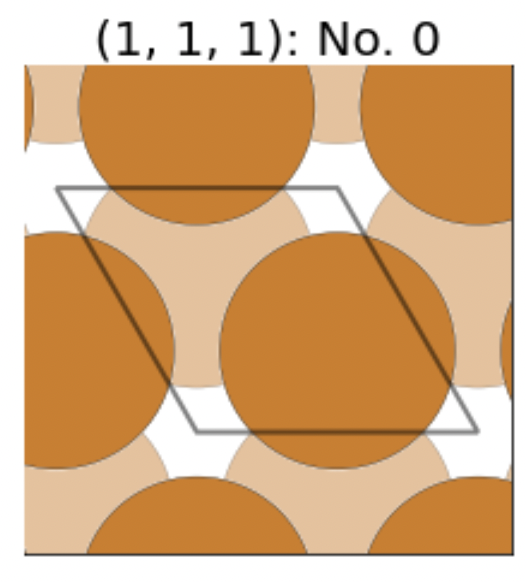

# AseBasic

<!--- [//]: # (Badges) 
[](https://github.com/REPLACE_WITH_OWNER_ACCOUNT/actgpaw/actions?query=workflow%3ACI)
[](https://codecov.io/gh/REPLACE_WITH_OWNER_ACCOUNT/ACTgpaw/branch/master) -->


A python package for bulk, adsorption and surface energy calculation for GPAW in Atomic Simulation Environment.

<!-- ---

### Table of Contents

- [Description](#description)
- [Installation](#installation)
- [How To Use](#how-to-use)
- [References](#references)
- [License](#license)
- [Author Info](#author-info)

---

## Description

Autonomous Convergence Toolkit for GPAW (**ACTgpaw**) is a python package aiming to streamline the convergence test procedures for the DFT study in [GPAW](https://wiki.fysik.dtu.dk/gpaw/#).

#### Current available autonomous convergence tests:
* Conventional Cell Calculator Settings
    * Grid Points 
    * K Points 
    * Smearing Width
* Slab Super Cell Settings
    * Number of Slab Layer

#### A useful add-on for adsorption energy: 
* This package can compute and select the lowest adsorption energy site from all sites created using [autocat](https://github.com/aced-differentiate/auto_cat). 

[Back To The Top](#actgpaw)

---

## How To Use

### Requirements
* pymatgen==2020.12.31
* numpy==1.19.5
* ase==3.20.1
* gpaw==20.10.1
* matplotlib==3.3.3
* autocat

### Installation
You can get the source for the latest release from (https://github.com/kianpu34593/actgpaw/):
```bash
$ git clone -b stable https://github.com/kianpu34593/actgpaw.git
```
Then, simply navigate to actgpaw directory and install using pip:
```bash
$ pip install -e .
```

### Tutorials
#### Workflow Introduction
**ACTgpaw** is very easy and intuitive to use. In general, the workflow looks like this:
* Start by preparing a .cif file of the material of interests;
* Create a directory for this material which is used to store optimization files.
* Write a script to use bulk_autoconv module to optimize the calculator parameters of the conventional cell.
* Analyze and create the surface of interests of the optimized material.
* Write a script to use surf_autoconv module to optimize the number of layers of the slab model.
* Generate adsorption sites on the surface using [autocat](https://github.com/aced-differentiate/auto_cat).
* Write a script to use ads_select module to pick the lowest adsorption energy site.
<div align="center">Workflow Visualization


</div>

#### STEP 0: Cif File Preparation
* Before downloading your favorite material's cif file, you want to create a directory to store it. Since you already spent time creating one directory, why not create a directory to store the final database as well? Luckily, a big directory creation function is implemented. 

    * You can create the input and output directories as follows:
        ```python
        from actgpaw import utils as ut
        ut.create_big_dir()
        ```
    * You should get the following sub-directories:
        ```bash
        actgpaw_demo/
        ├── final_database
        ├── orig_cif_data
        └── setup.ipynb
        ```
* Now, you can download cif file in orig_cif_data. You can manually select and download cif file from [The Materials Project](https://materialsproject.org/). Alternatively, you can also use the cif_grabber function in **ACTgpaw** providing the API key and formula of your favorite material. cif_grabber function will download the cif file of the lowest formation energy. NOTE: you need to download a conventional cell cif file if you choose the manual route. This is because ase and pymatgen generate slabs better with the conventional cell.
    * We will use Cu as an example:
        ```python
        from actgpaw import utils as ut
        API_key = "your-api-key"
        pretty_formula = 'Cu'
        ut.cif_grabber(API_key,pretty_formula)
        ```
    * You should get the following sub-directories:
        ```bash
        actgpaw_demo/
        ├── final_database
        ├── orig_cif_data
        │   └── Cu_mp-30.cif
        └── setup.ipynb
        ```
[Back To Workflow Intro](#workflow-introduction)
#### STEP 1: Create Directory for the Material
* We will first converge the calculator parameters of the bulk energy calculation. Therefore, we will only create bulk directory of the material of interest. When the surface analysis is finished, we can then create surf directory of the material of interest.
    * We will continue to use Cu as our example:
         ```python
        from glob import glob
        import re
        element_ls = glob('orig_cif_data/**.cif')
        for element in element_ls:
            element = re.split('\.',element)[0].split('/')[1]
            ut.create_element_dir(element, options = ['bulk'], optimized_parameters = ['h','k','sw'])
        ```
    * You should get the following sub-directories:
        ```bash
        actgpaw_demo/
        ├── Cu_mp-30
        │   └── bulk
        │       ├── results_h
        │       │   └── eos_fit
        │       ├── results_k
        │       │   └── eos_fit
        │       └── results_sw
        │           └── eos_fit
        ├── final_database
        ├── orig_cif_data
        │   └── Cu_mp-30.cif
        └── setup.ipynb
        ```
[Back To Workflow Intro](#workflow-introduction)
#### STEP 2: Bulk Convergence 
* Create a script in the actgpaw_demo directory. This script should include three parts:
    * Input the material
    * Initalize the calculator
    * Use bulk_auto_conv module
        * As an example, your code should look like the following:
        ```python
        from gpaw import GPAW, Mixer, Davidson
        from ase.calculators.calculator import kptdensity2monkhorstpack as kdens2mp
        from actgpaw import bulk_autoconv as bulk_ac

        # input the material
        element = 'Cu_mp-30' #the name should be the same as the cif file
        element_atom = bulk_ac.bulk_builder(element) #cif --> ase atom
        
        # initalize the calulator
        ## convert k density to kpts based on cell size
        kpts = kdens2mp(element_atom) 
        calc=GPAW(xc = 'PBE',
                    h = 0.16,
                    kpts = kpts,
                    spinpol = False,
                    maxiter = 333,
                    mixer = Mixer(0.05,5,50),
                    eigensolver = Davidson(3),
                    occupations = {'name':'fermi-dirac','width':0.1})
        
        # call bulk_auto_conv module
        bulk_ac.bulk_auto_conv(element, #input material
                                calc, #initial calculator
                                rela_tol=10*10**(-3), #convergence criteria
                                temp_print=True, #print out the convergence process
                                ) 
        ```
        * After running the script, you should get the following outputs:
            * Optimized bulk material with converged calculator settings saved in a database called "bulk.db" in final_database/ directory.
            * A result report with convergence process generated in the material/bulk/ directory.
            * Intermediate files during the convergence process all saved in the pre-generated directory.
            ```bash
            Cu_mp-30/
            └── bulk
                ├── sw_converge.db
                ├── results_report.txt
                ├── grid_converge.db
                ├── kpts_converge.db
                ├── results_h
                │   ├── bulk-compute-files
                │   └── eos_fit
                │       └── eos-fit-files
                ├── results_k
                │   ├── bulk-compute-files
                │   └── eos_fit
                │       └── eos-fit-files
                ├── results_sw
                │   ├── bulk-compute-files
                └── └── eos_fit
                        └── eos-fit-files
            ```
[Back To Workflow Intro](#workflow-introduction)

#### STEP 3: Surface Analysis
* STEP 3 is optional. Sometimes, however, choosing the right surface facet and termination can be quite challenging. That is exactly what STEP 3 is built for. You can use STEP 3 to analyze the slabs and save them for further investigation.
    * Under the hood, the code implemented for surface analysis is using [ASE](https://wiki.fysik.dtu.dk/ase/ase/build/surface.html) surface module and [pymatgen](https://pymatgen.org/pymatgen.core.surface.html) surface module. With **ACTgpaw**, you can easily combine these two powerful surface creation functions.
    * What you need for this step:
        * An optimized bulk material stored in "bulk.db" database which should be located in the final_database/ directory
        * (Optional) A visualization software for slab
        * (Optional) A cup of coffee/tea 
    * We will use Cu as an example:
        * First, we can look at all the possible miller indices. This might be simple for metals with a low-index surface. But it is very useful when dealing with alloys.
        ```python
        from actgpaw import surface as surf
        # specify the material
        element = 'Cu_mp-30'

        # maximum miller index
        max_ind = 1

        # layer parameters
        layers = 4
        vacuum_layers = 8

        # find all facets which have symmetric top and bottom termination 
        surf.sym_all_slab(element, max_ind, layers, vacuum_layers)
        ```
        * For Cu, the output is the following. The number of different shift is showing different kinds of terminations this facet have.
        ```bash
        Miller Index	Num of Different Shift(s)
        (1, 1, 1)	    1
        (1, 1, 0)	    1
        (1, 0, 0)	    1
        ```
        * Next, we can pick one of the miller indices shown above to analyze in detail. You can generate a surface plot and save the slab as cif file for further investigation. This is very useful for alloys.
        ```python
        from actgpaw import surface as surf
        # specify the material
        element = 'Cu_mp-30'

        # specify the miller index
        ind = (1,1,1)

        # specify the layer parameters
        layers = 4
        vacuum_layers = 2

        # surface generator under the hood
        option = 'pymatgen'

        # generate plot
        plot = True

        # save as cif file 
        save = False

        # which one to save 
        order = 0
        
        surf.surf_creator(element, ind, layers, vacuum_layers, 
                            unit=True, # if using pymatgen, specify the unit of layers (number[True]/length[False])
                            option=option,
                            save=save,
                            order=order,
                            plot=plot)
        ```
        * For Cu, the output is the following. You may have several possible terminations shown and plotted for alloys.
        ```bash
        No. Layers  Angles[deg]             Cell Length[ang]
        0   4       [ 90.  90. 120.]        [ 2.5756  2.5756 12.6177]
        ```
        

        * Lastly, if you want to save the slab and use them as the inputs of the surface convergence step, you can change the save option to True. This will allow slabs to save it in the material subdirectory (Cu_mp-30/raw_surf/ in this case). Because the surface convergence module allows six steps of convergence, you can save up to six cif files of the miller index of interest. For instance, for Cu, you will have the following files:
        ```bash
        raw_surf/
        ├── (1, 1, 1)_10.cif
        ├── (1, 1, 1)_12.cif
        ├── (1, 1, 1)_14.cif
        ├── (1, 1, 1)_4.cif
        ├── (1, 1, 1)_6.cif
        └── (1, 1, 1)_8.cif
        ```
[Back To Workflow Intro](#workflow-introduction)

#### STEP 3.5: Create Surface Directory for the Material
* Just before you can start the surface convergence test, you want to create directories to store the intermediate files created when computing the slabs. The following code was implemented to help you streamline this process:
```python
from actgpaw import utils as ut
element = 'Cu_mp-30'
ut.create_element_dir(element,
                        options = ['surf'],
                        surf_struc = ['111'],
                        starting_layer = 4,
                        interval = 2)
```
* After running the code, you should get the directories: 
```bash
surf/
└── 111
    ├── 10x1x1
    ├── 12x1x1
    ├── 14x1x1
    ├── 4x1x1
    ├── 6x1x1
    └── 8x1x1
```
* In general, your directory structure should look like this:
```bash
Cu_mp-30/
├── bulk
├── raw_surf
└── surf
    └── 111
        ├── 10x1x1
        ├── 12x1x1
        ├── 14x1x1
        ├── 4x1x1
        ├── 6x1x1
        └── 8x1x1
```
[Back To Workflow Intro](#workflow-introduction)

#### STEP 4: Surface Convergence
* Finally, we are ready for the surface convergence test. The surf_auto_conv module allows you to converge test the number of layers of the slab. 
    * What you need for this step:
        * An optimized bulk material stored in "bulk.db" database which should be located in the final_database/ directory
        * Empty directories to store the slab files
        * (Optional) pre-generated slab cif file stored in raw_surf/ directory
        * (Optional) some NVIDIA Tesla GPUs
    * Create a script in the actgpaw_demo directory. This script should include three parts:
        * Obtain the converged calculator parameters
        * Set up the calculator
        * Use surf_auto_conv module
            * As an example, your code should look like the following:
            ```python
            from ase.db import connect
            from gpaw import GPAW, Mixer, MixerDif, Davidson, PoissonSolver
            from actgpaw import surf_autoconv as surf_ac

            # read the optimized conventional cell in the database
            element = "Cu_mp-30"
            element_bulk = connect("final_database/bulk.db").get(name=element)
            h = element_bulk.h
            xc = element_bulk.xc
            sw = element_bulk.sw
            spin = element_bulk.spin
            ## all settings but kpts (due to structure dependence)

            # miller index of interest
            struc = "111"

            # set up the calculator
            calc = GPAW(
                xc = xc,
                h = h,
                symmetry = {"point_group": False},
                eigensolver = Davidson(3),
                mixer = Mixer(beta=0.05, nmaxold=5, weight=50),
                spinpol = spin,
                maxiter = 500,
                occupations = {"name": "fermi-dirac", "width": sw},
                poissonsolver = {'dipolelayer': 'xy'},
            )

            # call surf_auto_conv module
            surf_ac.surf_auto_conv(
                element, #input material
                struc, #miller index of interest
                calc, #calculator
                generator = "import", #import the slab model 
                pbc_all = False, #periodic boundary condition true for all directions
                init_layer = 4, #initial slab layers
                interval = 2, #interval between layers
                fix_layer = 2, #number of fixed layers
                fix_option='bottom', #constrain the bottom layers
                vac = 10, #vacuum size (Ang)
                rela_tol = 5, #convergence criteria (%)
                temp_print = True, #print out the convergence process
            )
            ```
            * In this code, there are several parameters are new in the surf_auto_conv:
                * generator: this parameter allows you to create slabs during the convergence test using 'ase' or 'pymatgen'. If using this approach, you do not need to save the cif files during STEP 3. However, for alloys, this might not be ideal because the slab creation sometimes needs some manual tweaking. 
                * pbc_all: this parameter controls the periodic boundary conditions of the slab. For more details, you can find it in [GPAW](https://wiki.fysik.dtu.dk/gpaw/documentation/manual.html#manual-poissonsolver) poissiosolver section.
                * fix_option: this parameter controls whether the fixed layers are center layers or bottom layers. NOTE: after benchmarking the surface energy of some pure metals with [this paper](https://www.nature.com/articles/sdata201680), we found that fixing bottom layers produce same results as the slabs that fix no layer.
                * vac: this parameter adjusts the vacuum size in the slab. The adjusted slab will be center in the supercell with top and bottom vacuum size equals *vac*
    * After running the script, you should get the following outputs:
        * Optimized slab with converged number of layers saved in a database called "surf.db" in final_database/ directory.
        * A result report with convergence process generated in the material/surf/ directory.
        * Intermediate files during the convergence process all saved in the pre-generated directory.

[Back To Workflow Intro](#workflow-introduction)

#### STEP 5: Generate Adsorption Sites with autocat
* This step is for those who may want to compute the adsorption energy. With the optimized slab, you can now find the adsorption sites with autocat.
    * We will use Cu as an example:
    ```python
    from actgpaw import utils as ut
    element = 'Cu_mp-30'
    surf_struc = ['111']
    ut.create_ads_and_dir(element,surf_struc,ads_atom=['Li'],ads_site=['ontop','hollow','bridge'])
    ```
    * You should get the following files and directories:
    ```bash
    Cu_mp-30/
    ├── ads
    │   └── 111
    │       └── adsorbates
    │           └── Li
    │               ├── bridge
    │               │   └── -0.647_1.861
    │               │       └── input.traj
    │               ├── hollow
    │               │   ├── -0.003_1.489
    │               │   │   └── input.traj
    │               │   └── 2.572_0.002
    │               │       └── input.traj
    │               └── ontop
    │                   └── 1.284_0.745
    │                       └── input.traj
    ├── bulk
    ├── raw_surf
    └── surf
    ```
[Back To Workflow Intro](#workflow-introduction)

#### STEP 6: Select Lowest Adsorption Energy Site
* To streamline the computation of the adsorption energy, you can use the ads_selector module to compute and select the lowest adsorption energy site.
    * We will use Cu as an example:
    ```python
    from actgpaw import ads_selector
    from gpaw import GPAW, MixerSum, Mixer, MixerDif, Davidson
    from ase.db import connect

    # specify the material and miller index of interest
    element = "Cu_mp-30"
    struc = "111"

    # read the optimized conventional cell in the database
    element_surf = connect("final_database/surf.db").get(name=element + "(" + struc + ")")
    h = element_surf.h
    xc = element_surf.xc
    sw = element_surf.sw
    spin = element_surf.spin
    kpts = [int(i) for i in (element_surf.kpts).split(",")]

    # set up the calculator
    calc = GPAW(
        xc=xc,
        h=h,
        kpts=kpts,
        symmetry={"point_group": False},
        eigensolver=Davidson(3),
        mixer=Mixer(beta=0.05, nmaxold=5, weight=50),
        spinpol=spin,
        maxiter=333,
        occupations={"name": "fermi-dirac", "width": sw},
        poissonsolver={"dipolelayer": "xy"},
    )

    # call ads_selector module
    ads_selector.ads_auto_select(
        element,
        struc,
        calc,
        ads="Li",  # specify adsorbate
        ads_pot_e=-1.89678,  # adsorbate energy
        size="1x1",  # specify the size of the supercell (xy)
        temp_print=True,  # print out the convergence process
    )
    ```
    * After running the script, you should get the following outputs:
        * Lowest adsorption energy site slab saved in a database called "ads1x1.db" in final_database/ directory.
        * A result report with convergence process generated in the material/ads/ directory.
        * Intermediate files during the convergence process all saved in the pre-generated directory.

[Back To Workflow Intro](#workflow-introduction)

You just completed the tutorial. Congratulations! Hope that was helpful. All the code used in this tutorial and database generated is saved in the tutorial/ directory. Intermediate files generated are omitted to save space.

---

## References
[Back To The Top](#actgaw)

---

## License

MIT License

Copyright (c) [2017] [James Q Quick]

Permission is hereby granted, free of charge, to any person obtaining a copy
of this software and associated documentation files (the "Software"), to deal
in the Software without restriction, including without limitation the rights
to use, copy, modify, merge, publish, distribute, sublicense, and/or sell
copies of the Software, and to permit persons to whom the Software is
furnished to do so, subject to the following conditions:

The above copyright notice and this permission notice shall be included in all
copies or substantial portions of the Software.

THE SOFTWARE IS PROVIDED "AS IS", WITHOUT WARRANTY OF ANY KIND, EXPRESS OR
IMPLIED, INCLUDING BUT NOT LIMITED TO THE WARRANTIES OF MERCHANTABILITY,
FITNESS FOR A PARTICULAR PURPOSE AND NONINFRINGEMENT. IN NO EVENT SHALL THE
AUTHORS OR COPYRIGHT HOLDERS BE LIABLE FOR ANY CLAIM, DAMAGES OR OTHER
LIABILITY, WHETHER IN AN ACTION OF CONTRACT, TORT OR OTHERWISE, ARISING FROM,
OUT OF OR IN CONNECTION WITH THE SOFTWARE OR THE USE OR OTHER DEALINGS IN THE
SOFTWARE.

[Back To The Top](#read-me-template)

---

## Author Info

- Email - [Kian Pu](mailto:kianpu01@gmail.com?subject=[GitHub]%20ACTgpaw)

[Back To The Top](#actgpaw)

### Copyright

Copyright (c) 2021, Kian Pu


#### Acknowledgements
 
Project based on the 
[Computational Molecular Science Python Cookiecutter](https://github.com/molssi/cookiecutter-cms) version 1.5. -->
