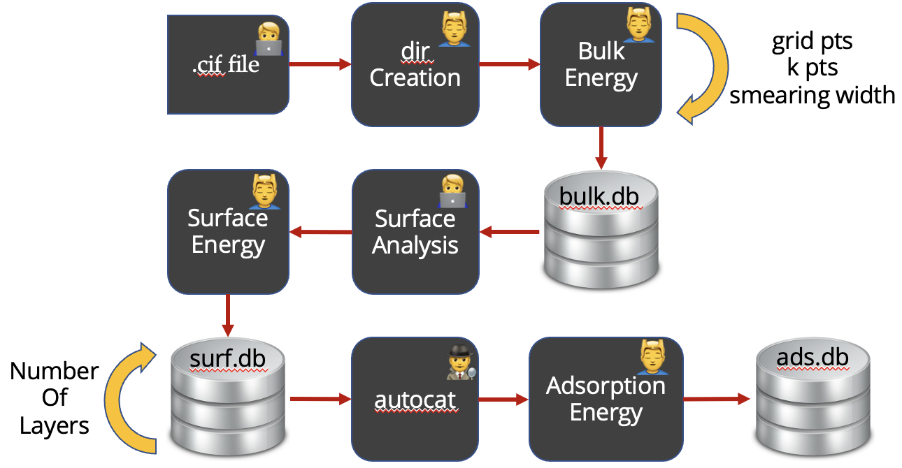

# ACTgpaw

<!--- [//]: # (Badges) 
[](https://github.com/REPLACE_WITH_OWNER_ACCOUNT/actgpaw/actions?query=workflow%3ACI)
[](https://codecov.io/gh/REPLACE_WITH_OWNER_ACCOUNT/ACTgpaw/branch/master) -->


A Python package for autonomous convergence test of GPAW. 


---

### Table of Contents

- [Description](#description)
- [Installation](#installation)
- [How To Use](#how-to-use)
- [References](#references)
- [License](#license)
- [Author Info](#author-info)

---

## Description

Autonomous Convergence Toolkit for GPAW (**ACTgpaw**) is a python package aiming to streamline the convergence test procedures before the DFT study in [GPAW](https://wiki.fysik.dtu.dk/gpaw/#).

#### Current available autonomous convergence tests:
* Conventional Cell Calculator Settings
    * Grid Points 
    * K Points 
    * Smearing 
* Slab Super Cell Settings
    * Slab Layer

#### A useful add-on for adsorption energy: 
* This package can compute and select the lowest adsorption energy site from all sites created using [autocat](https://github.com/aced-differentiate/auto_cat). 

[Back To The Top](#actgpaw)

---

## How To Use

### Requirements

### Installation
You can get the source for the latest release from (https://github.com/kianpu34593/actgpaw/):
```html
$ git clone -b stable https://github.com/kianpu34593/actgpaw.git
```
Then, simply navigate to actgpaw directory and install using pip:
```html
$ pip install -e .
```

### Tutorials
#### Workflow Introduction
ACTgpaw is very easy and intuitive to use. In general, the workflow looks like this:
* Start by preparing a .cif file of the material of interests;
* Create a directory for this material which is used to store optimization files.
* Write a script to use bulk_autoconv module to optimize the calculator parameters of conventional cell.
* Analyze and create the surface of interests of the optimized material.
* Write a script to use surf_autoconv module to optimize the number of layers of the slab model.
* Generate adsorption sites on the surface using [autocat](https://github.com/aced-differentiate/auto_cat).
* Write a script to use ads_select module to pick the lowest adsorption energy site.
<div align="center">Workflow Visualization


</div>

#### STEP 0: Cif File Preparation
Before downloading your favorite material's cif file, you want to create a directory to store it. Since you already spent time creating one directory, why not create a directory to store the final database as well? Luckily, a big directory creation function is implemented. 

You can create the input and ouput directories as following:
```html
from actgpaw import utils as ut
ut.create_big_dire()
```
You should get the following sub-directories:
```bash
actgpaw_demo/
├── final_database
├── orig_cif_data
└── setup.ipynb
```


#### API Reference

```html
    <p>dummy code</p>
```
[Back To The Top](#read-me-template)

---

## References
[Back To The Top](#read-me-template)

---

## License

MIT License

Copyright (c) [2017] [James Q Quick]

Permission is hereby granted, free of charge, to any person obtaining a copy
of this software and associated documentation files (the "Software"), to deal
in the Software without restriction, including without limitation the rights
to use, copy, modify, merge, publish, distribute, sublicense, and/or sell
copies of the Software, and to permit persons to whom the Software is
furnished to do so, subject to the following conditions:

The above copyright notice and this permission notice shall be included in all
copies or substantial portions of the Software.

THE SOFTWARE IS PROVIDED "AS IS", WITHOUT WARRANTY OF ANY KIND, EXPRESS OR
IMPLIED, INCLUDING BUT NOT LIMITED TO THE WARRANTIES OF MERCHANTABILITY,
FITNESS FOR A PARTICULAR PURPOSE AND NONINFRINGEMENT. IN NO EVENT SHALL THE
AUTHORS OR COPYRIGHT HOLDERS BE LIABLE FOR ANY CLAIM, DAMAGES OR OTHER
LIABILITY, WHETHER IN AN ACTION OF CONTRACT, TORT OR OTHERWISE, ARISING FROM,
OUT OF OR IN CONNECTION WITH THE SOFTWARE OR THE USE OR OTHER DEALINGS IN THE
SOFTWARE.

[Back To The Top](#read-me-template)

---

## Author Info

- Twitter - [@jamesqquick](https://twitter.com/jamesqquick)
- Website - [James Q Quick](https://jamesqquick.com)

[Back To The Top](#read-me-template)

### Copyright

Copyright (c) 2021, Kian Pu


#### Acknowledgements
 
Project based on the 
[Computational Molecular Science Python Cookiecutter](https://github.com/molssi/cookiecutter-cms) version 1.5.
